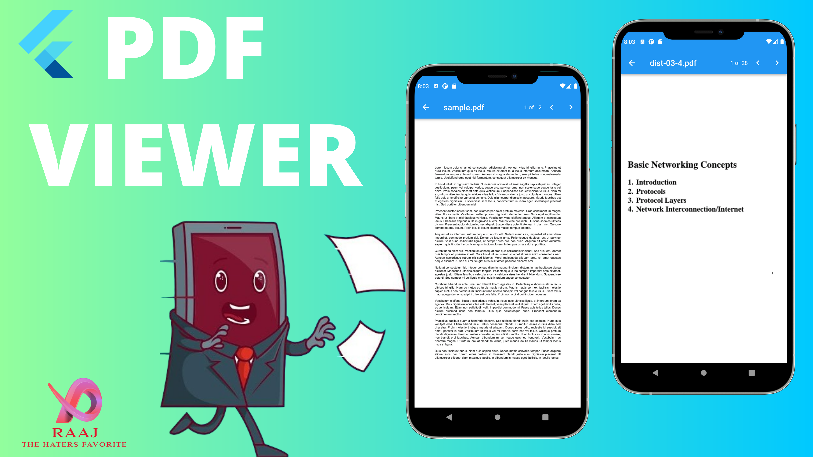

# Flutter_PdfViewer

Use the Flutter PDF Viewer to download PDF documents and display them within your Flutter app.

## [Watch it on YouTube](https://youtu.be/wyGh3a96vkM)

   
**Packages we are using:**

-   http: [link](https://pub.dev/packages/http)
-   flutter_pdfview: [link](https://pub.dev/packages/flutter_pdfview)
-   path_provider: [link](https://pub.dev/packages/path_provider)
-   file_picker: [link](https://pub.dev/packages/file_picker)
-   shared_preferences: [link](https://pub.dev/packages/shared_preferences)
